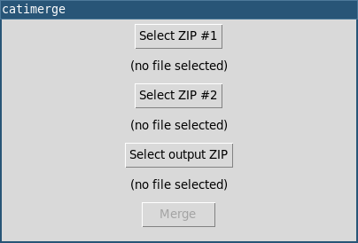

<!-- SPDX-FileCopyrightText: 2023 FC Stegerman <flx@obfusk.net> -->
<!-- SPDX-License-Identifier: AGPL-3.0-or-later -->

[](https://github.com/obfusk/catimerge/releases)
[](https://pypi.python.org/pypi/catimerge)
[](https://pypi.python.org/pypi/catimerge)
[](https://github.com/obfusk/catimerge/actions?query=workflow%3ACI)
[](https://www.gnu.org/licenses/agpl-3.0.html)

<!--
<a href="https://repology.org/project/catimerge/versions">
  
</a>

<a href="https://repology.org/project/python:catimerge/versions">
  
</a>
-->

# catimerge

Merge two [Catima](https://catima.app) `.zip` exports.

```sh
$ catimerge --help
usage: catimerge [-h] [-v] [--version] FIRST_ZIP SECOND_ZIP OUTPUT_ZIP

positional arguments:
  FIRST_ZIP
  SECOND_ZIP
  OUTPUT_ZIP

options:
  -h, --help     show this help message and exit
  -v, --verbose
  --version      show program's version number and exit
$ catimerge -v catima1.zip catima2.zip out.zip
Merging 'catima1.zip' and 'catima2.zip' into 'out.zip'...
Parsing...
Version: 2
ZIP #1 has   1 group(s),   9 card(s),   2 card group(s),   5 image file(s)
ZIP #2 has   2 group(s),   5 card(s),   3 card group(s),   3 image file(s)
Merging...
Output has   3 group(s),  14 card(s),   5 card group(s),   8 image file(s)
Writing...
```

## GUI

The additional `catimerge-gui` command provides a simple GUI.



## CAVEATS

Unfortunately, Python does not support the password-protected ZIP
files created by Catima.  You can either export your data without a
password, or use a tool like 7-Zip to create a temporary passwordless
ZIP file for the merge process.

For example, if you have two password-protected ZIP files as input and
want a password-protected output ZIP file as well:

<details>

```sh
$ ls
catima1.zip
catima2.zip
$ 7z -ocatima1 x catima1.zip            # extract into catima1/
[...]
$ 7z -ocatima2 x catima2.zip            # extract into catima2/
[...]
$ cd catima1
$ 7z a ../catima1-nopass.zip *          # create passwordless ZIP
[...]
$ cd ..
$ cd catima2
$ 7z a ../catima2-nopass.zip *          # create passwordless ZIP
[...]
$ cd ..
$ catimerge -v catima1-nopass.zip catima2-nopass.zip out-nopass.zip
Merging 'catima1-nopass.zip' and 'catima2-nopass.zip' into 'out-nopass.zip'...
[...]
$ 7z -oout-nopass x out-nopass.zip      # extract into out-nopass/
$ cd out-nopass
$ 7z -p a ../out.zip *                  # create password-protected ZIP
[...]
$ cd ..
$ ls
catima1
catima1-nopass.zip
catima1.zip
catima2
catima2-nopass.zip
catima2.zip
out-nopass
out-nopass.zip
out.zip
```

</details>

## Installing

### Using pip

```bash
$ pip install catimerge
```

NB: depending on your system you may need to use e.g. `pip3 --user`
instead of just `pip`.

### From git

NB: this installs the latest development version, not the latest
release.

```bash
$ git clone https://github.com/obfusk/catimerge.git
$ cd catimerge
$ pip install -e .
```

NB: you may need to add e.g. `~/.local/bin` to your `$PATH` in order
to run `catimerge`.

To update to the latest development version:

```bash
$ cd catimerge
$ git pull --rebase
```

## Dependencies

* Python >= 3.8 (w/ Tk support for the GUI).

### Debian/Ubuntu

```bash
$ apt install python3-tk
```

## License

[](https://www.gnu.org/licenses/agpl-3.0.html)

<!-- vim: set tw=70 sw=2 sts=2 et fdm=marker : -->
